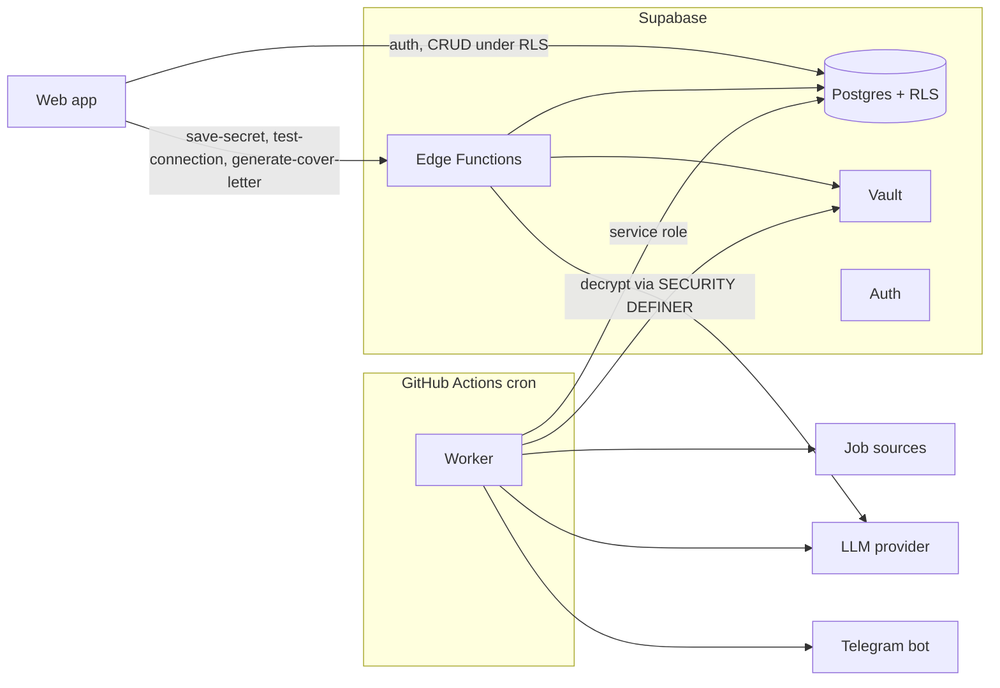

# JobMatch AI

Open source job aggregator that scores vacancies against your profile with an LLM and notifies the good ones on Telegram.

Applications are **semi-automatic**: the tool prepares the score, the rationale and a cover letter, and you review and apply yourself. There is no browser automation for applying (LinkedIn and Indeed forbid bots).

- **Zero cost**: Supabase, GitHub Actions, Netlify/Vercel and the LLM providers all have free tiers that are enough.
- **BYOK**: every instance uses its owner's keys. Keys live encrypted in Supabase Vault and never return to the browser.
- **Private by design**: email, phone and address are stripped from your CV before anything reaches an LLM.

## How it works



Pipeline per run: **collect** (Remotive, Arbeitnow, RemoteOK, Greenhouse, Lever, optional Adzuna and ITJobs.pt) → **normalize** → **dedupe** (by `source + external id` and by a title/company hash across sources) → **rule filter** (free, no LLM) → **LLM score** → **notify** on Telegram → **log the run**.

## Repository layout

```
apps/web         React + Vite + Tailwind (landing, auth, dashboard, settings)
apps/worker      Node script executed by GitHub Actions
packages/core    runtime-agnostic logic: types, collectors, normalizers, dedupe, rules, LLM layer, prompts
supabase/        migrations and Edge Functions
docs/SPEC.md    implementation plan and decisions
```

`packages/core` only uses `fetch` and Zod, so the same code runs in Node (worker) and Deno (Edge Functions).

## Self-hosting

You need free accounts on Supabase, GitHub, Netlify (or Vercel) and a Telegram account.

1. **Create a Supabase project** (free tier).
2. **Apply the migrations.** With the [Supabase CLI](https://supabase.com/docs/guides/cli): `supabase link --project-ref <ref>` then `supabase db push`. Alternatively paste the files in `supabase/migrations` into the SQL editor, in order. All objects are prefixed `jm_`, so the app can share a project with others.
3. **Configure Auth** (Authentication → URL Configuration): add your frontend URL and `https://<your-site>/**` to the redirect URLs. Magic link works out of the box. For GitHub login, enable the GitHub provider and set `VITE_ENABLE_GITHUB_OAUTH=true`.
4. **Deploy the Edge Functions**: `pnpm build:edge` (bundles `packages/core` into `supabase/functions/_shared/core.js`), then `supabase functions deploy save-secret test-connection generate-cover-letter`.
5. **Create a Telegram bot** with [@BotFather](https://t.me/BotFather) and copy the token. Send any message to the bot, then open `https://api.telegram.org/bot<token>/getUpdates` to find your `chat.id`.
6. **Get a free Gemini key** at [Google AI Studio](https://aistudio.google.com/apikey). Groq, OpenRouter and a local Ollama also work.
7. **Set the worker secrets** in GitHub (Settings → Secrets and variables → Actions): `SUPABASE_URL` and `SUPABASE_SERVICE_ROLE_KEY`. The workflow in `.github/workflows/worker.yml` runs every 2 hours and can be triggered manually. The service role key never leaves GitHub Secrets.
8. **Deploy the frontend** on Netlify or Vercel: build command `pnpm build`, publish directory `apps/web/dist`. Environment variables are in `.env.example` (`VITE_SUPABASE_URL`, `VITE_SUPABASE_ANON_KEY`, `VITE_ALLOW_SIGNUPS`, `VITE_ENABLE_GITHUB_OAUTH`, `VITE_REPO_URL`).
9. **Create your account.** The first account is always allowed. Then keep `VITE_ALLOW_SIGNUPS=false` so strangers cannot sign up on your instance and spend your quota. Signups are also enforced in the database by the `jm_signup_gate` trigger; to allow more accounts set `allow_signups = true` in `jm_app_config`. For a dedicated Supabase project you can additionally disable signups in the Auth settings.
10. **Fill in Settings and Profile**: choose the provider, save your key, set the Telegram token and chat ID, send the test message, paste your CV and preferences.

### Local development

```bash
pnpm install
cp .env.example apps/web/.env.local   # fill the VITE_* values
pnpm --filter @jobmatch/web dev
pnpm check                            # lint, format, typecheck, tests
SUPABASE_URL=... SUPABASE_SERVICE_ROLE_KEY=... JOBMATCH_FORCE=1 pnpm --filter @jobmatch/worker start
```

The worker falls back to `LLM_API_KEY`, `TELEGRAM_BOT_TOKEN` and `TELEGRAM_CHAT_ID` when no key is saved in the database (useful for development).

## Free tier limits and privacy

- **Supabase free**: 500 MB database, Edge Function invocations and Auth emails are limited. The built-in SMTP sends only a few emails per hour, so configure a custom SMTP if you rely on magic links. Free projects are paused after a week of inactivity.
- **GitHub Actions**: scheduled runs can be delayed by many minutes, and in public repositories schedules are disabled after 60 days without repository activity.
- **LLM free tiers** have per-minute and per-day quotas. The worker limits concurrency, retries HTTP 429 with exponential backoff and stops at the daily limit you configure.
- **Gemini free tier may use submitted data to improve Google's models.** Do not send anything you consider confidential. Use a paid key, Groq, OpenRouter or a local Ollama if that matters to you.
- CV sanitization (email, phone, address) is heuristic and does not guarantee that all personal data is removed.
- **Job sources**: Remotive asks clients to poll sparingly, and RemoteOK requires linking back to the source. Respect each source's terms.

## License

MIT
